<a name="top"></a>
<div align="center">

# 🏋️ Gym Business Performance Dashboard

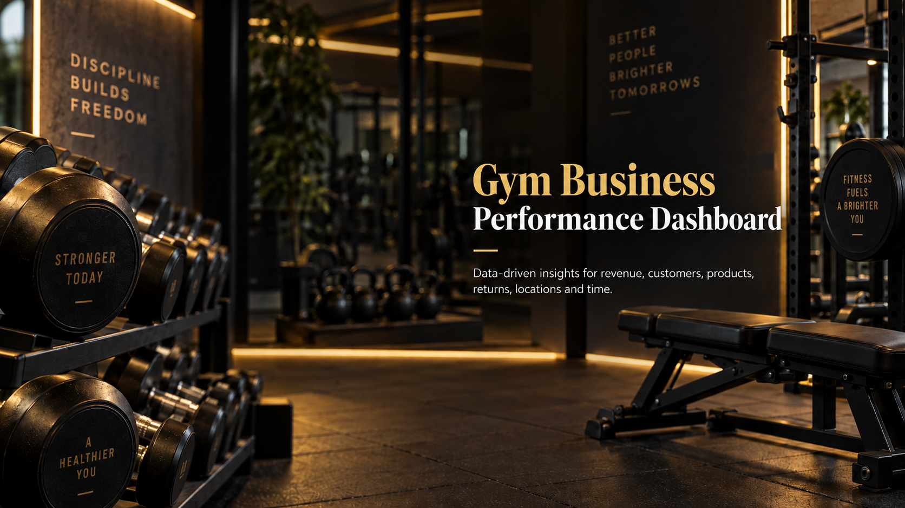

<p>
  
  
  
  
</p>

*Transforming fragmented Excel tables into an interactive business performance dashboard for a gym and fitness-products business.*

</div>

---

## 📑 Table of Contents

- [Project Overview](#-project-overview)
- [Dataset Overview](#-dataset-overview)
- [Business Objectives](#-business-objectives)
- [Headline KPIs](#-headline-kpis)
- [Analytics Workflow](#-analytics-workflow)
- [Data Transformation](#-data-transformation)
- [Data Modeling](#-data-modeling)
- [Dashboard Pages](#-dashboard-pages)
- [Main Business Recommendations](#-main-business-recommendations)
- [Analytical Features](#-analytical-features)
- [Important Data Notes](#-important-data-notes)
- [Tools and Skills](#-tools-and-skills)
- [Repository Structure](#-repository-structure)
- [Author](#-author)

---

## 📌 Project Overview

This Power BI project transforms a group of fragmented Excel tables into an interactive business performance dashboard for a gym and fitness-products business. The report brings revenue, gross profit, cost, customer behavior, product performance, returns, locations, and time trends into one analytical experience.

The work covered the full analytics process: understanding the source tables, cleaning and reshaping the data in Power Query, allocating discounts at line level, redesigning the data model, creating DAX measures, building interactive report pages, and translating the results into business recommendations.

> **Data availability:** The source Excel files are intentionally not included in this public repository. This repository documents the analytical process, data model, dashboard design, and findings.

<div align="right"><a href="#top">⬆ back to top</a></div>

---

## 🗄️ Dataset Overview

| Attribute | Value |
| --- | --- |
| Source | 9 Excel tables |
| Period | December 2010 – November 2013 |
| SalesDetails (transaction rows) | 60,855 |
| Orders | 3,796 |
| Customers | 701 (635 with orders, 66 without orders) |
| Products | 349 |
| Countries | 6 |

> **Note:** The 60,855 row count refers to the **SalesDetails** table only, not the sum of rows across all source tables. A single order can span multiple SalesDetails rows, since each row represents one product line within that order.

**Original source tables:** `Customers`, `Geography`, `Region`, `Product`, `ProductSubcategory`, `ProductCostHistory`, `SalesHeader`, `SalesDetails`, `SalesReturns`.

<div align="right"><a href="#top">⬆ back to top</a></div>

---

## 🎯 Business Objectives

The dashboard was designed to answer the following questions:

- How are revenue, gross profit, and cost changing over time?
- Which countries, customer groups, and business types drive performance?
- Which products generate the most revenue and profit?
- Which products or markets create margin pressure?
- How well does the business retain and activate customers?
- Where are returns concentrated, and which products require attention?
- Which regions, states, cities, and customers explain location-level changes?

<div align="right"><a href="#top">⬆ back to top</a></div>

---

## 📊 Headline KPIs

| KPI | Result |
| --- | ---: |
| 💵 Revenue | **$78.87M** |
| 📈 Gross Profit | **$54.17M** |
| 💸 Total Cost | **$24.70M** |
| 📐 Gross Margin | **68.7%** |
| 📦 Quantity Sold | **214K** |
| ✅ Customers with Orders | **635** |
| ⚠️ Customers without Orders | **66** |
| 🧾 Orders | **3,796** |
| 🔄 Return Amount | **$6.39M** |

<div align="right"><a href="#top">⬆ back to top</a></div>

---

## 🔄 Analytics Workflow

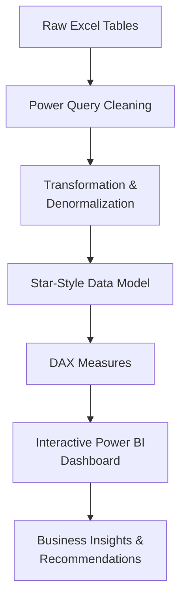

<div align="right"><a href="#top">⬆ back to top</a></div>

---

## 🧹 Data Transformation

The original data was distributed across sales, returns, customer, geography, region, product, subcategory, and product-cost-history tables. The main transformation steps included:

1. Standardize column names and data types.
2. Merge Geography and Region into Customer.
3. Merge ProductSubcategory into Product.
4. Merge SalesHeader data into SalesDetails.
5. Add the variable cost from ProductCostHistory to SalesDetails, matched by product, location, and period.
6. Allocate the order discount to its line items proportionally, using:

   ```text
   Allocated Line Discount =
       (Line Sales Before Discount / Order Sales Before Discount) × Order Discount
   ```

7. Subtract each line's allocated discount to calculate its post-discount revenue.
8. Create a Date Table.
9. Organize the model into SalesDetails and SalesReturns as Fact tables, with Product, Customer, and Date as shared dimensions.

<div align="right"><a href="#top">⬆ back to top</a></div>

---

## 🗂️ Data Modeling

### Before → After

| Original Model | Optimized Model |
| :---: | :---: |
| 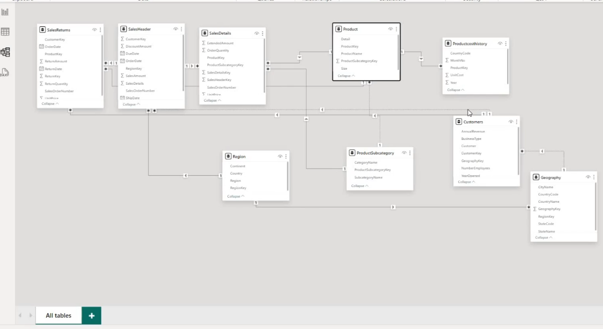 | 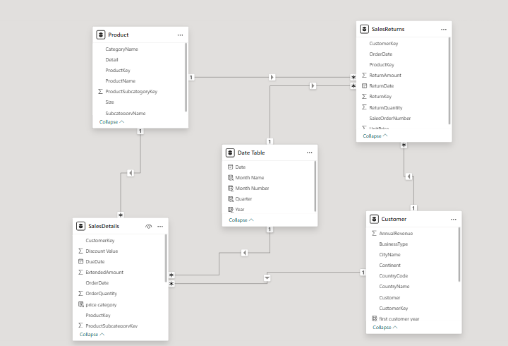 |
| Multiple chained lookup tables with several possible filter paths. | Reshaped into an analytics-ready, star-style fact constellation. |

**The optimized model consists of:**

- **SalesDetails** — sales transactions and line-level commercial measures.
- **SalesReturns** — return transactions and returned quantities/amounts.
- **Product** — consolidated product, subcategory, category, size, and detail attributes.
- **Customer** — consolidated customer and location attributes.
- **Date Table** — shared calendar dimension for time intelligence.

This structure reduced model complexity, simplified filter propagation, and made the DAX measures easier to maintain.

<div align="right"><a href="#top">⬆ back to top</a></div>

---

## 📊 Dashboard Pages

| # | Page |
| :---: | --- |
| 1 | [Business Overview](#1-business-overview) |
| 2 | [Customer Analysis](#2-customer-analysis) |
| 3 | [Product Analysis](#3-product-analysis) |
| 4 | [Returns Analysis](#4-returns-analysis) |
| 5 | [Revenue Trend Analysis](#5-revenue-trend-analysis) |
| 6 | [Profit Trend Analysis](#6-profit-trend-analysis) |
| 7 | [Cost Trend Analysis](#7-cost-trend-analysis) |
| 8 | [Location Drill-Through](#8-location-drill-through) |

### 1. Business Overview

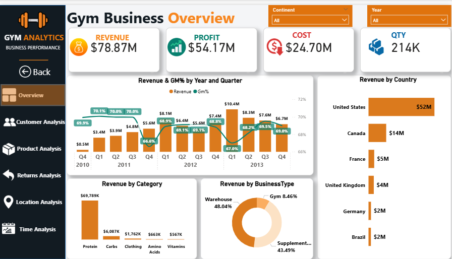

The overview page summarizes performance by year, quarter, country, product category, and business type.

**Key Findings**

- Revenue reached **$78.87M**, generating **$54.17M** in gross profit at a **68.7% gross margin**.
- The United States was the largest market with approximately **$52M** in revenue, followed by Canada with **$14M**.
- Protein generated approximately **$69.79M**, making it the dominant product category.
- Warehouse and supplement-store customers generated most of the revenue.
- The November 2011 margin decline was mainly driven by a higher sales mix of low-margin 5 lb whey-protein SKUs, which generated margins of approximately **29–30%**. The country comparison did not show a material cost difference between Canada and the United States for that specific issue.

### 2. Customer Analysis

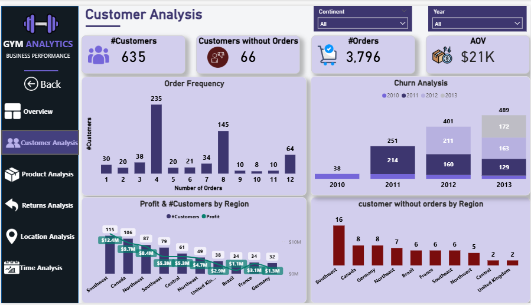

This page analyzes customer activation, order frequency, cohort behavior, regional profitability, and customers with no orders.

**Key Findings**

- The customer table contains **701 customer records**: **635** customers placed at least one order, while **66** never placed an order.
- The business generated **3,796 orders**, or approximately **6 orders per active customer** across the available period.
- Order frequency peaks at 4, 8, and 12 orders, indicating recurring purchase patterns among a large share of customers.
- Earlier customer cohorts declined over time, while total active customers continued to grow because new acquisition offset attrition.
- Brazil and France each had 34 active customers, but Brazil generated only about **$1.1M** in profit compared with **$3.1M** in France.
- Brazil's underperformance was associated with fewer orders, lower average order value, and a much higher cost percentage (**43.1% versus approximately 31.1%** in France and the United Kingdom).

### 3. Product Analysis

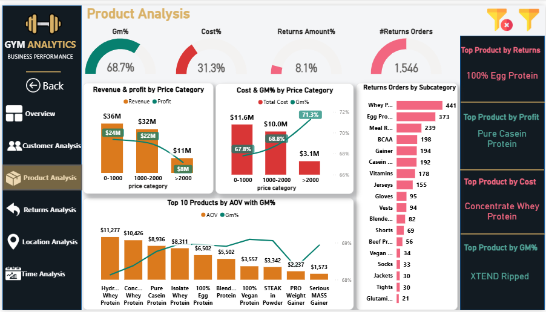

The product page compares price bands, margins, costs, returns, average order value, and the strongest products by different business measures.

**Key Findings**

- Products priced below $2,000 generated approximately **86% of total revenue**.
- The price band above $2,000 produced the highest gross margin at **71.3%**, but contributed only around **$11M** in revenue.
- **Pure Casein Protein** generated the highest total profit.
- **Concentrate Whey Protein** generated the highest absolute cost, largely because of its sales scale; however, its cost percentage became a specific concern in Brazil.
- **100% Egg Protein** was the most significant return-risk product, with approximately **$2.37M** returned, equal to **22.4% of its sales** and about **37% of the total return amount**.
- The Egg Protein return-value rate remained above 24% in 2011 and 2012, before improving to **13.4% in 2013**.
- **XTEND Ripped** recorded the highest gross-margin percentage, but its revenue contribution was very small, showing why percentage leadership should always be considered alongside business scale.

### 4. Returns Analysis

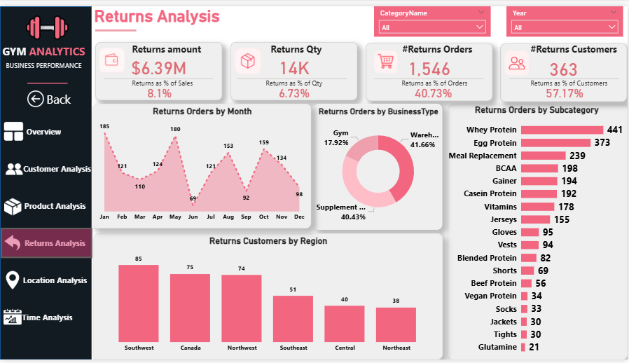

This page evaluates returned value, quantity, orders, customers, categories, business types, regions, and monthly patterns.

**Key Findings**

- Returns totaled **$6.39M**, equal to **8.1% of sales**.
- Approximately **14K units** were returned, representing **6.73% of sold quantity**.
- **1,546 orders** contained at least one returned item. The returned-order percentage is much higher than the returned-quantity percentage, indicating that many returns were partial rather than complete order cancellations.
- 2012 recorded the highest return value and return-value rate at approximately **$2.93M** and **10.7%**.
- The return-value rate improved to **6.7% in 2013**, even though the returned quantity remained high, indicating a shift toward lower-value returned items.
- Protein accounted for approximately **$5.76M**, or about **90% of the total return amount**.
- Recorded returns were limited to North American regions. No return transactions were recorded for Brazil, France, Germany, or the United Kingdom in the provided returns table.

### 5. Revenue Trend Analysis

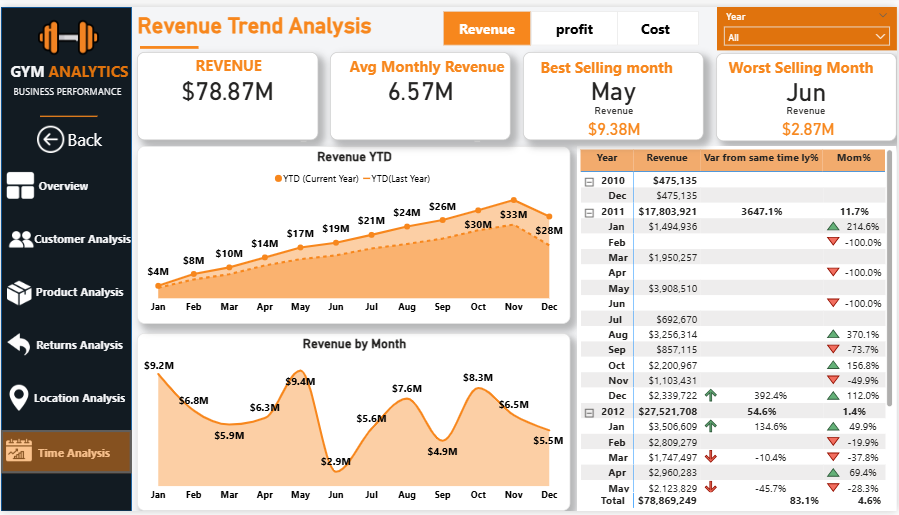

**Key Findings**

- Revenue increased from **$17.80M in 2011** to **$27.52M in 2012**, a **54.6% increase**.
- By November 2013, revenue had reached **$33.07M**, already exceeding the full-year 2012 result.
- On a January-to-November comparison, 2013 revenue was approximately **33.4% higher** than the same period in 2012.
- January was the strongest month in both 2012 and 2013, while June was the weakest, suggesting a recurring mid-year slowdown.
- The extremely high 2011 year-over-year percentage is not treated as normal growth because 2010 contains only a limited baseline.

### 6. Profit Trend Analysis

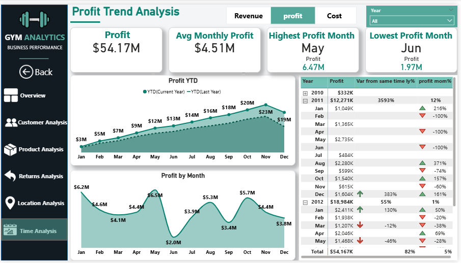

**Key Findings**

- Profit increased from **$12.27M in 2011** to **$18.98M in 2012**, a **54.7% increase**.
- Profit reached **$22.58M by November 2013**.
- On a January-to-November basis, 2013 profit was approximately **31.9% higher** than the comparable 2012 period.
- Every available month in 2013 produced more profit than the corresponding month in 2012.
- May produced the highest combined monthly profit across the dataset, while June produced the lowest.

### 7. Cost Trend Analysis

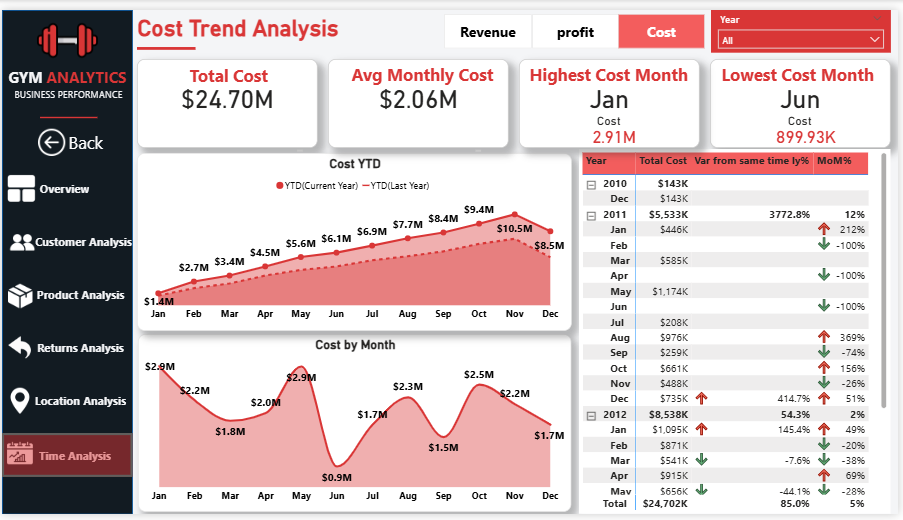

**Key Findings**

- Total cost reached **$24.70M**, or approximately **31.3% of revenue**.
- Cost increased from **$5.53M in 2011** to **$8.54M in 2012**, closely matching revenue and profit growth and indicating stable cost efficiency.
- Cost reached **$10.49M by November 2013**.
- During January–November 2013, cost grew by approximately **36.6%**, slightly faster than revenue and profit, creating limited margin pressure.
- January was the highest-cost month and June was the lowest, largely following sales-volume seasonality.

### 8. Location Drill-Through

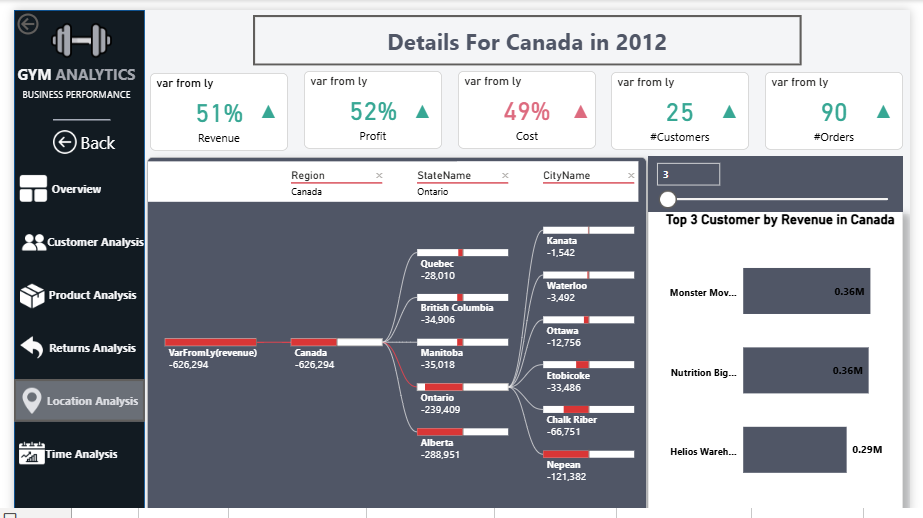

This page is designed as a drill-through destination. From a selected country, the user can review:

- Year-over-year changes in revenue, profit, cost, customers, and orders.
- Contribution by region, state, and city through a decomposition tree.
- A dynamic Top-N view of the highest-revenue customers.

**Key Findings**

- For Canada in 2012, revenue increased by **51%**, profit by **52%**, and cost by **49%**, while the customer base increased by 25 and orders increased by 90.
- The Top 3 customers generated roughly **$1.01M**, showing a meaningful concentration of country revenue among a small number of accounts.

<div align="right"><a href="#top">⬆ back to top</a></div>

---

## 💡 Main Business Recommendations

| # | Recommendation | Action |
| :---: | --- | --- |
| 1 | **Investigate the 100% Egg Protein return issue** | Prioritize the 2011–2012 period and the Southeast and Northeast regions, then review the higher-priced SKUs, batches, and fulfillment process. |
| 2 | **Protect profitable core products** | Maintain availability of Pure Casein Protein and other high-contribution products while monitoring their absolute return exposure. |
| 3 | **Improve Brazil's product economics** | Review pricing, procurement, and product mix for Concentrate, Hydrolyzed, and Isolate Whey Protein, particularly the 5 lb variants. |
| 4 | **Activate and retain more customers** | Target the 66 never-ordered customers with onboarding offers, and create lifecycle campaigns for customers whose purchasing frequency is declining. |
| 5 | **Plan around seasonality** | Prepare inventory and campaigns for the strong January demand period and investigate the repeated June slowdown. |
| 6 | **Balance margin and scale** | Test premium and high-margin products selectively rather than treating a high margin percentage alone as proof of growth potential. |

<div align="right"><a href="#top">⬆ back to top</a></div>

---

## ⚙️ Analytical Features

- DAX-based revenue, cost, gross profit, margin, AOV, and return measures.
- Year-over-year and month-over-month comparisons.
- YTD performance against the prior year.
- Dynamic titles and filter-aware KPIs.
- Customer order-frequency and cohort analysis.
- Category, product, country, continent, year, and region filtering.
- Country-to-city drill-through analysis.
- Decomposition tree and dynamic Top-N customer analysis.
- Consistent page navigation and report branding.

<div align="right"><a href="#top">⬆ back to top</a></div>

---

## 📝 Important Data Notes

- The source data is not published in this repository.
- 2010 is a partial baseline and should not be used as a normal full-year comparison.
- 2013 ends in November, so full-year comparisons require careful interpretation.
- The returns table does not contain a return-reason field; operational causes are therefore presented as hypotheses, not confirmed explanations.
- The absence of international return records may reflect the coverage of the returns table rather than proof of zero real-world returns.
- Return-order counts represent orders containing at least one returned item and should not be interpreted as fully cancelled orders.
- The reported profit is a gross-profit measure derived from revenue and product cost; returns are analyzed separately.

<div align="right"><a href="#top">⬆ back to top</a></div>

---

## 🛠️ Tools and Skills

| Tool / Skill | Role in this project |
| --- | --- |
| 📊 **Power BI Desktop** | Dashboard design and interactive reporting. |
| 🔧 **Power Query** | Cleaning, merging, and transforming source tables. |
| 🧮 **DAX** | KPIs, time intelligence, ratios, rankings, and dynamic titles. |
| 📈 **Excel** | Original tabular data sources. |
| 🗂️ **Data Modeling** | Denormalization, shared dimensions, and star-style modeling. |

<div align="right"><a href="#top">⬆ back to top</a></div>

---

## 📁 Repository Structure

```text
Gym-Business-Performance-Dashboard/
├── README.md
├── .gitignore
└── images/
    ├── 00-cover.png
    ├── 01-overview.png
    ├── 02-customer-analysis.png
    ├── 03-product-analysis.png
    ├── 04-returns-analysis.png
    ├── 05-revenue-trend.png
    ├── 06-profit-trend.png
    ├── 07-cost-trend.png
    ├── 08-location-drillthrough.png
    ├── 09-data-model-before.png
    └── 10-data-model-after.png
```

<div align="right"><a href="#top">⬆ back to top</a></div>

---

## 👤 Author

**Asem Fared**
AI & DATA SCIENTIST Student — Menofia University
Data Analysis and Power BI Portfolio Project

<div align="right"><a href="#top">⬆ back to top</a></div>
